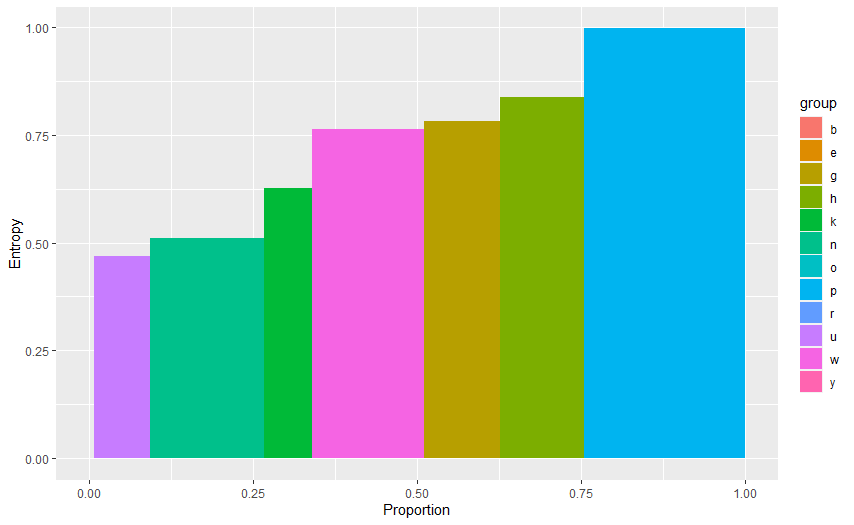
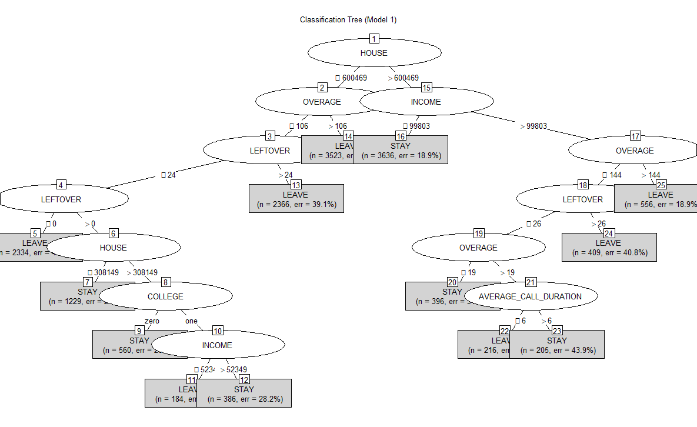
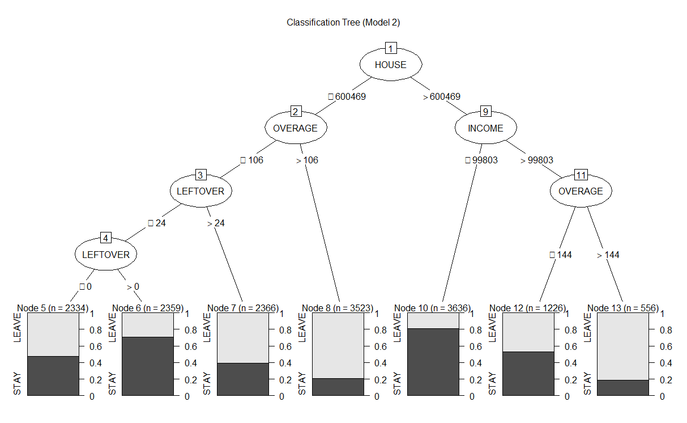
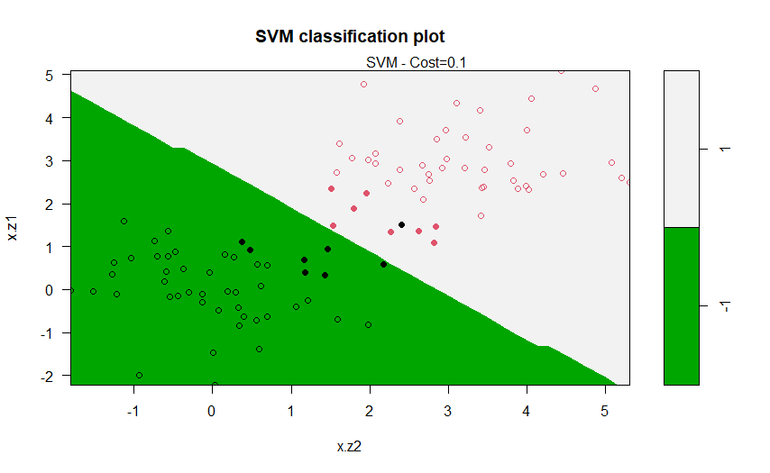
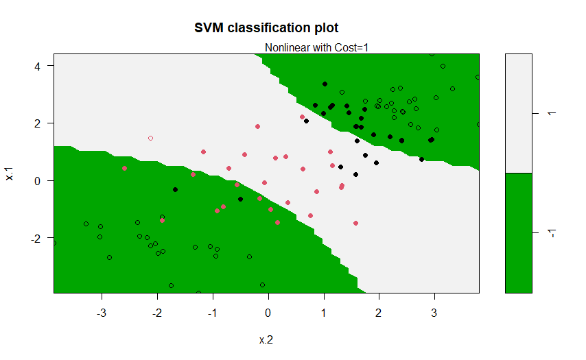
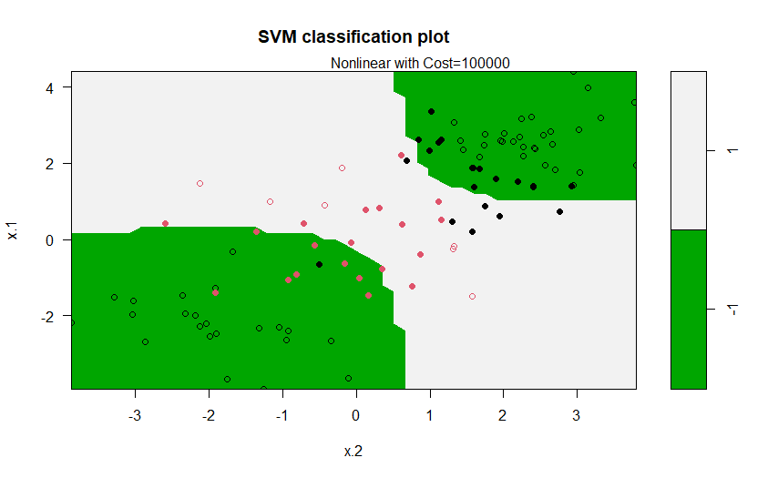
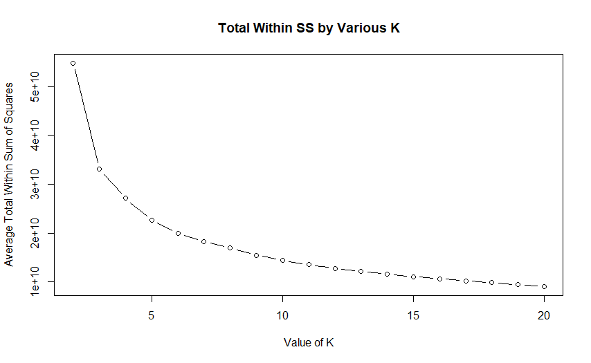
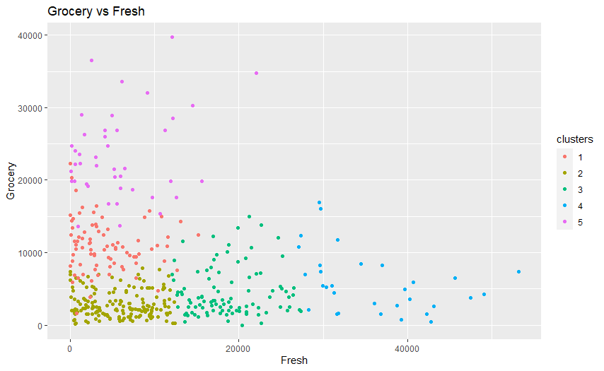
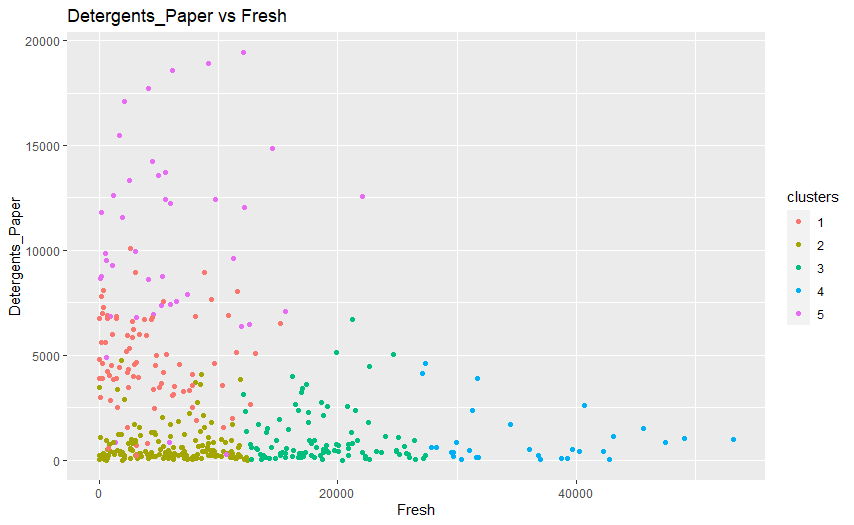
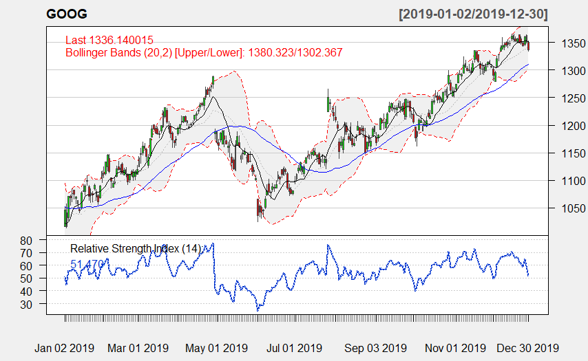

# Algo`s included:
1. Entropy
2. Decision Tree
3. SVM
4. Kmeans
5. KNN
6. Trading - quantmod

# 1A) Entropy - Code:
https://github.com/trajceskijovan/Data-Science-in-R/blob/main/0_Entropy.R

# 1B) Entropy - Samples:

# 2A) Decision Tree - Code:
https://github.com/trajceskijovan/Data-Science-in-R/blob/main/1_Tree.R

# 2B) Decision Tree - Samples:

# 3A) SVM - Code:
https://github.com/trajceskijovan/Data-Science-in-R/blob/main/2_SVM.R

# 3B) SVM - Samples:

# 4A) Kmeans - Code:
https://github.com/trajceskijovan/Data-Science-in-R/blob/main/3_kmeans.R

# 4B) Kmeans - Samples:

# 6A) Trading - Code:
https://github.com/trajceskijovan/Data-Science-in-R/blob/main/5_Trading.R

# 6B) Trading - Samples:

