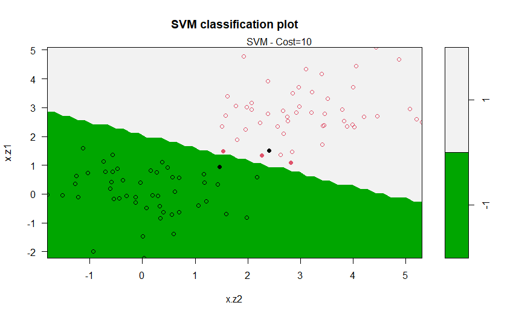

# Algo`s included:
1. Entropy
2. Decision Tree
3. SVM

# 1A) Entropy - Code:

# 1B) Entropy - Samples:

# 2A) Decision Tree - Code:
https://github.com/trajceskijovan/Data-Science-in-R/blob/main/R3_Tree.R

# 2B) Decision Tree - Samples:

# 3A) SVM - Code:
https://github.com/trajceskijovan/Data-Science-in-R/blob/main/2_SVM.R

# 3B) SVM - Samples:

